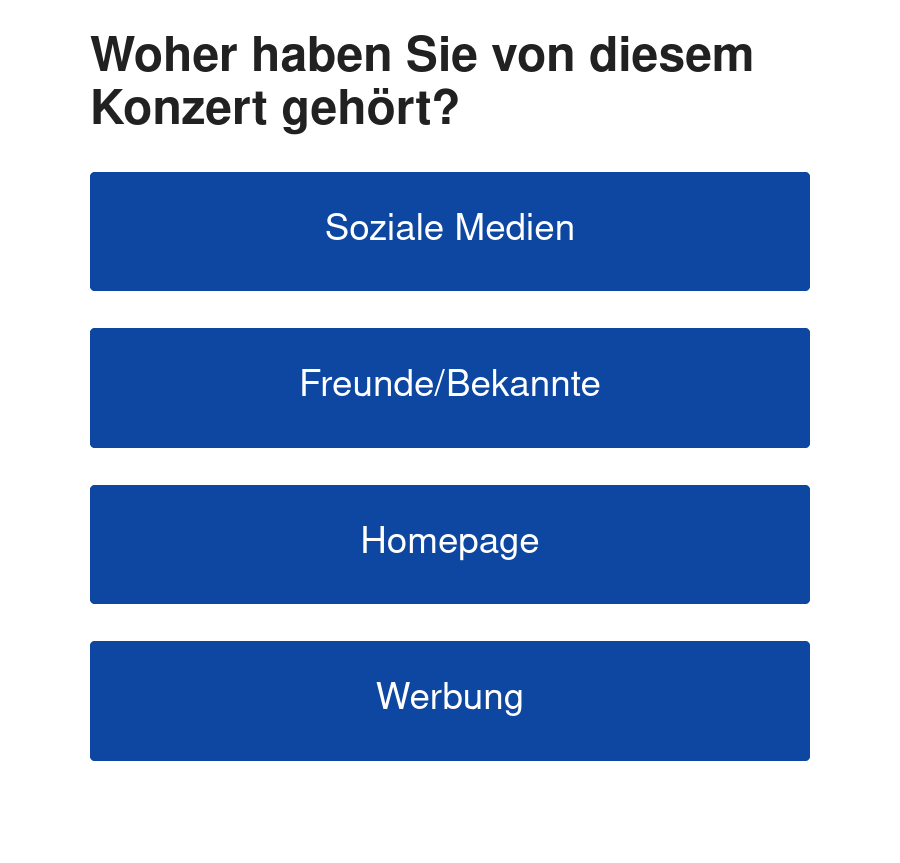

# offlineHTMLKioskPoll
Simple static single HTML page that offers visitors a poll without the need of an internet connection. Made for a tablet in kiosk-mode.

This is a simple static website, displaying buttons a visitor can click to participate on your poll.
It is intended to be used on an tablet without internet connection that you can place somewhere.
The result can later be viewed directly on the page itself, including timestamps when a button was pressed.
For storing the results, only the local webstorage is used, no internet connection required.

## Usage
* Edit the index.html according to your needs (change the buttons).
* Edit in counter.js the function createStatsBulk()
	* here, the list must be according to the button name (Improvement: This could be done automatically)
* Place the files on your tablet and use a browser to display them:
	* Some kiosk-mode apps can display the HTML-website directly
	* Otherwise you need a local webserver to display it (can be installed as an app)
* Let the poll begin
* The results can be directly viewed on the page with an additional button at the very end.
	* It displays the timestamp and counter for each button
	* To reset the poll, clear your local webstorage.

## References
* css-style from [https://simplecss.org/](https://simplecss.org/)

